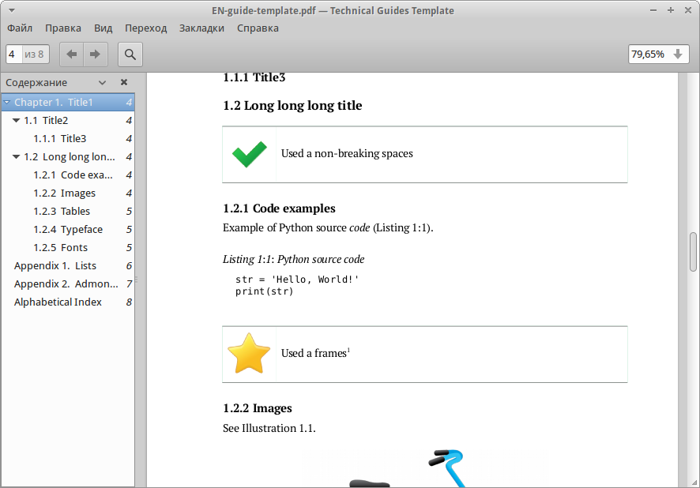

Шаблон LibreOffice для технических руководств
=============================================

Шаблон LibreOffice для технических руководств(Technical Guides Template)

**Шаблоны руководств (Templates):**

* EN-guide-template.ott
* RU-guide-template.ott 

**Шаблоны руководств без встроенных шрифтов (Templates without fonts):**

* EN-guide-template(no-fonts).ott
* RU-guide-template(no-fonts).ott

**Примеры (Examples):**

* EN-guide-template.odt
* RU-guide-template.odt

**Шрифты (Fonts):**

* PT Serif (http://www.paratype.ru/public/)
* DejaVu

To the extent possible under law, Dmitry Mazhartsev has waived all copyright and related or neighboring rights to Technical Guides Template for LibreOffice. This work is published from: Russian Federation. 

.. image:: cc-zero.svg
   :align: center

**Скриншоты:**

.. image:: screenshot_001.png
   :scale: 50 %
   
----

